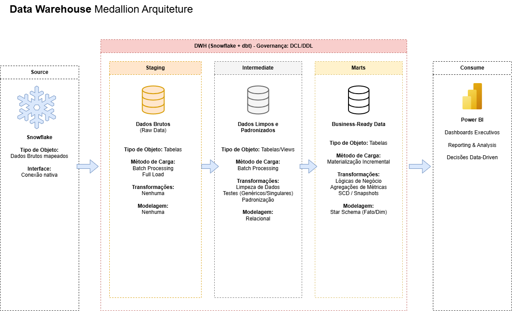
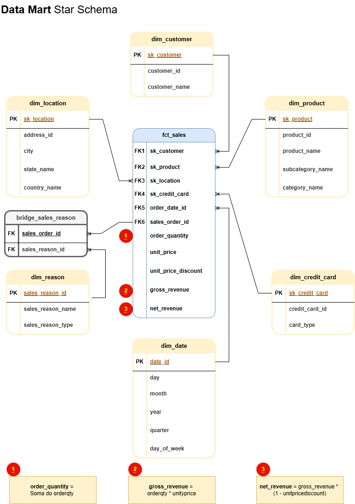

# 🚀 Projeto de Data Warehouse & BI: Adventure Works

## 1. Contexto e Objetivo do Projeto

A Adventure Works é uma indústria de bicicletas em forte expansão. 

A empresa possui mais de 500 produtos distintos, 20.000 clientes e 31.000 pedidos. 
Para manter seu ritmo de crescimento, a diretoria decidiu utilizar seus dados de forma estratégica. 
O objetivo principal deste projeto é construir uma infraestrutura moderna de *analytics*. 
Com isso, a Adventure Works possuirá uma base sólida para se tornar uma organização guiada por dados (*data-driven*).

---

## 2. Especificações e Entregáveis

Para atender aos requisitos do projeto, a entrega foi estruturada nos seguintes pilares:

*   **Modelo Conceitual:** Criação de um diagrama conceitual do Data Warehouse. O desenho mapeia a relação entre as tabelas fontes, as dimensões e a tabela fato.
*   **Infraestrutura e Nuvem:** Configuração de um Data Warehouse em nuvem integrado para suportar as operações analíticas.
*   **Transformação com dbt:** Utilização do dbt para transformar os dados brutos em modelos dimensionais eficientes.
*   **Controle de Qualidade:** Implementação de testes em fontes (*sources*) e chaves primárias (*primary keys*) nas tabelas de dimensão e fatos.
*   **Auditoria de Dados:** Criação de um teste de dados customizado, conforme exigência da diretoria. O teste garante que o valor bruto das vendas do ano de 2011 seja exatamente de $12.646.112,16.
*   **Documentação e Versionamento:** Documentação detalhada das tabelas e colunas geradas nos *marts*. Todo o código foi versionado e armazenado neste repositório do GitHub.
*   **Visualização e BI:** Construção de um painel interativo de *Business Intelligence*. O dashboard responde diretamente a todas as seis perguntas de negócio estipuladas pela diretoria.

---

## 3. Arquitetura e Fluxo de Dados (Dataflow)



A arquitetura do projeto segue o padrão do *Modern Data Stack*. 
Os dados brutos são extraídos do banco transacional da empresa e carregados no ambiente de nuvem. 
A partir daí, o fluxo de transformação é dividido em camadas (Arquitetura Medalhão).

Nesta arquitetura, temos 03 camadas: 

* A camada inicial (*Staging/Bronze*) apenas espelha os dados da fonte de forma bruta.
* A camada intermediária (*Silver*) aplica regras de limpeza e padronização.
* A camada final (*Gold/Marts*) consolida a modelagem dimensional em esquema estrela (*Star Schema*).

  
  
Todo esse processo de transformação, documentação e testes é governado unicamente pelo dbt.
Por fim, os dados tratados são conectados à ferramenta de BI para o consumo final.

---

## 4. Visualização de Dados (Dashboard)


O painel de BI foi construído de forma altamente interativa. 
Ele centraliza as métricas criadas na tabela fato, como número de pedidos, quantidade comprada e valor total negociado. 
O dashboard responde com precisão às seguintes exigências de negócio:

* Qual o número de pedidos, quantidade comprada, valor total negociado por mês e ano ?

* Quais os produtos com maior ticket médio por mês, ano, cidade, estado e país?

* Quais os 10 melhores clientes por valor total negociado filtrado por produto, tipo de cartão, motivo de venda, data de venda, status, cidade, estado e país?

* Qual produto tem a maior quantidade de unidades compradas para o motivo de venda “Promotion”?

* Quais as 5 melhores cidades em valor total negociado por produto, tipo de cartão, motivo de venda, data de venda, cliente, status, cidade, estado e país?

* Qual o número de pedidos, quantidade comprada, valor total negociado por produto, tipo de cartão, motivo de venda, data de venda, cliente, status, cidade, estado e país?

---
  ## 5. Licença
  
Este projeto está licenciado sob a MIT License.

Você tem permissão para usar, copiar, modificar, mesclar, publicar, distribuir, sublicenciar e/ou vender cópias deste software. A única exigência é que o aviso de direitos autorais e o aviso de permissão sejam incluídos em todas as cópias ou partes substanciais do software.

  ## 6. Estrutura do Repositório

O repositório foi organizado para manter a clareza do projeto dbt e armazenar os recursos visuais. A estrutura principal conta com as seguintes pastas e arquivos na raiz:

```text
📦 adventure-works-analytics
 ┣ 📂 analyses/             # Consultas SQL e análises exploratórias
 ┣ 📂 img/                  # Imagens e GIFs utilizados na documentação (Arquitetura e Dashboard)
 ┣ 📂 macros/               # Macros customizadas em SQL/Jinja
 ┣ 📂 models/               # Modelos de transformação de dados (Bronze, Silver e Gold)
 ┣ 📂 seeds/                # Arquivos CSV estáticos carregados diretamente no banco
 ┣ 📂 snapshots/            # Configuração de SCD (Slowly Changing Dimensions)
 ┣ 📂 tests/                # Testes singulares e de auditoria de dados
 ┣ 📜 .gitignore            # Regras de arquivos e pastas ignorados pelo Git
 ┣ 📜 dbt_project.yml       # Arquivo de configuração principal do projeto dbt
 ┣ 📜 LICENSE               # Arquivo de licença do repositório
 ┣ 📜 package-lock.yml      # Controle exato de versão das dependências do dbt
 ┣ 📜 packages.yml          # Lista de pacotes e dependências externas instaladas
 ┗ 📜 README.md             # Documentação principal e apresentação do projeto

